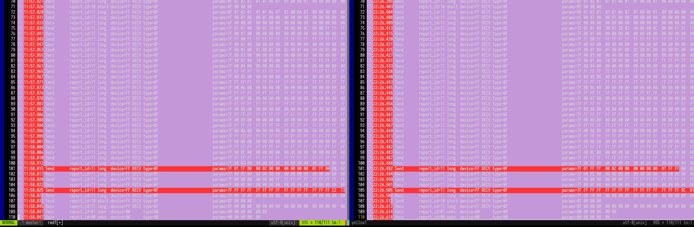
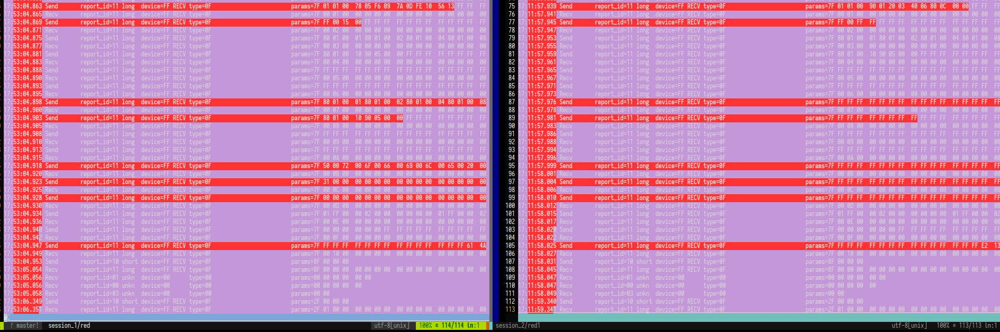

# Useful debugging links and commands

`lsusb -v -d 046d:c084`

[Basic USB/libusb terminology](https://www.oreilly.com/library/view/linux-device-drivers/0596005903/ch13.html)

[HID handshake for a  Wicom tablet](https://stackoverflow.com/questions/37163207/reverse-engineering-a-hid-handshake-by-examining-bytes-over-usb)

[Wireshark terms wrt USB](https://desowin.org/usbpcap/capture_limitations.html)

[libusb error enums](http://libusb.sourceforge.net/api-1.0/group__libusb__misc.html#ggab2323aa0f04bc22038e7e1740b2f29efa790feab8b45d8c323038f4d7d15eceec)

[How to debug the code we have written (using usbmon)](https://wiki.wireshark.org/CaptureSetup/USB)

[HID-API (below is the code)](https://github.com/libusb/hidapi)

[HID wrapper over libusb](https://valelab4.ucsf.edu/svn/3rdpartypublic/hidapi/hidapi-0.7.0/linux/hid-libusb.c)

[A dead USB snoopy app to libusb pl script](https://alioth-lists.debian.net/pipermail/libhid-discuss/2008-December/000555.html)

[PR tracker](https://stackoverflow.com/questions/65086528/reverse-engineering-a-usbhid-logitech-mouse-driver)

[RGB C driver for a keyboard](https://github.com/wroberts/rogauracore/blob/master/src/rogauracore.c)

[Debug Logitech devices](https://lekensteyn.nl/logitech-unifying.html)

[PR tracker](https://stackoverflow.com/questions/65179875/incorrect-implementation-of-request-type-in-libusb-when-replicating-a-usbhid-tra)

[How to load your own *custom* mouse driver](https://stackoverflow.com/questions/25175960/which-drivers-are-used-by-usb-mouse-in-linux-kernel)

If want to use Wireshark debugging in Linux
```
sudo modprobe usbmon
# Use the below in bash
sudo setfacl -m u:$USER:r /dev/usbmon*
```

# Why Onboard Memory Manager is so secretive

By using logging tools such as wireshark and ltunify, it was known a random hash value is being used by the program to obfuscate the packets. Consider every time you open and close Onboard Memory Manager app in Windows/Mac to be a session. Hence, as shown in first figure below - we are comparing a solid color packet being sent to mouse. 

One can see that the only difference is the hex value of the colors which has been input twice in that same packet (line 101). The second difference is in line 105 - which is where it gets tricky. The last 2 bytes are randomly assigned (or here use a hash value). This value is the exact same if the same color is sent in the *same session*. If not: 

You can see there is a huge difference between the two - even though the RGB data value they are sending is the same(#FF0000 again on line 101). This led me to conclusion that based on the packets sent earlier - the values are pushed into this *hash function* and generates 2 byte hashes which are then appended to line 105.

Though we can still change RGB/DPI values in register 3 of the mouse which is the oasis in the middle of this desert! 